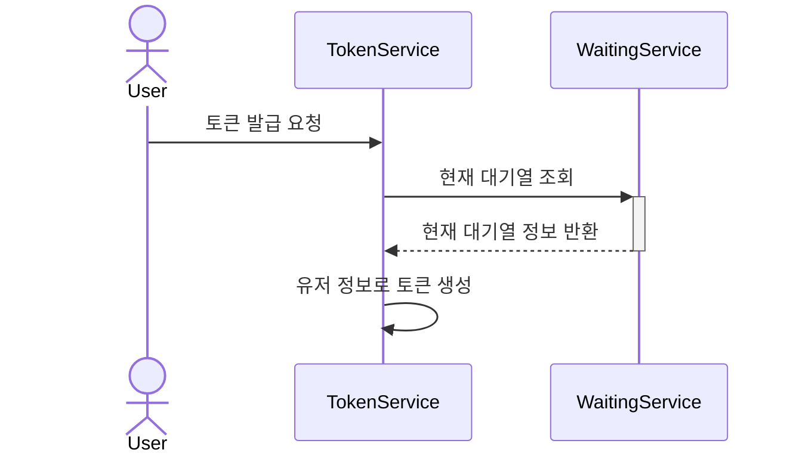
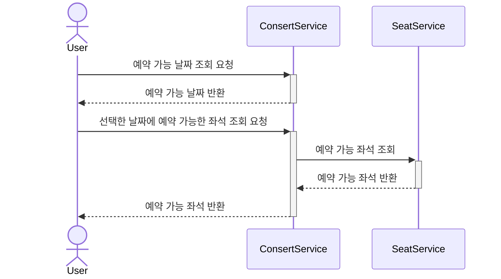
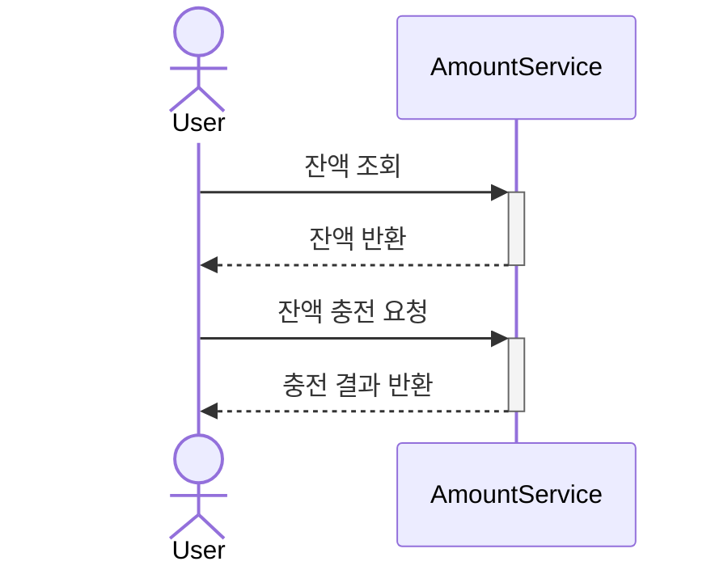
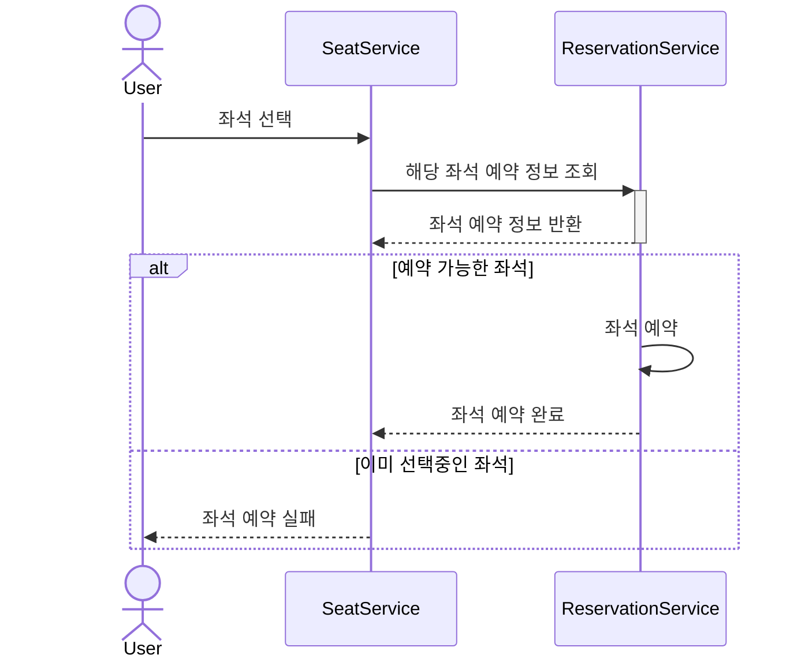
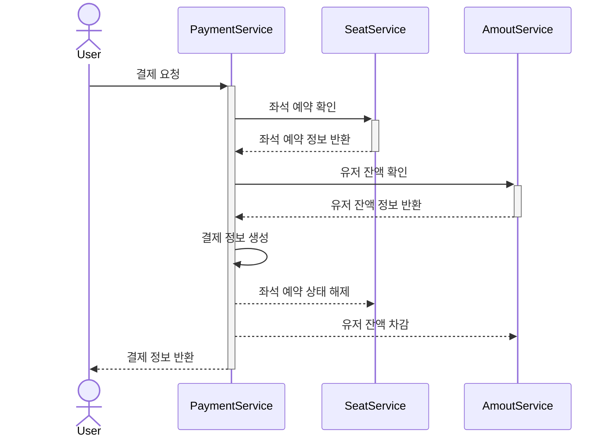

# Consert Reservation API

## 요구사항
- 아래 5가지 API 를 구현합니다.
    - 유저 토큰 발급 API
    - 예약 가능 날짜 / 좌석 API
    - 좌석 예약 요청 API
    - 잔액 충전 / 조회 API
    - 결제 API
- 각 기능 및 제약사항에 대해 단위 테스트를 반드시 하나 이상 작성하도록 합니다.
- 다수의 인스턴스로 어플리케이션이 동작하더라도 기능에 문제가 없도록 작성하도록 합니다.
- 동시성 이슈를 고려하여 구현합니다.
- 대기열 개념을 고려해 구현합니다.

## Sequence Diagram

### 유저 토큰 발급 API

### 예약 가능 날짜 / 좌석 API

### 잔액 충전 / 조회 API

### 좌석 예약 요청 API

### 결제 API

