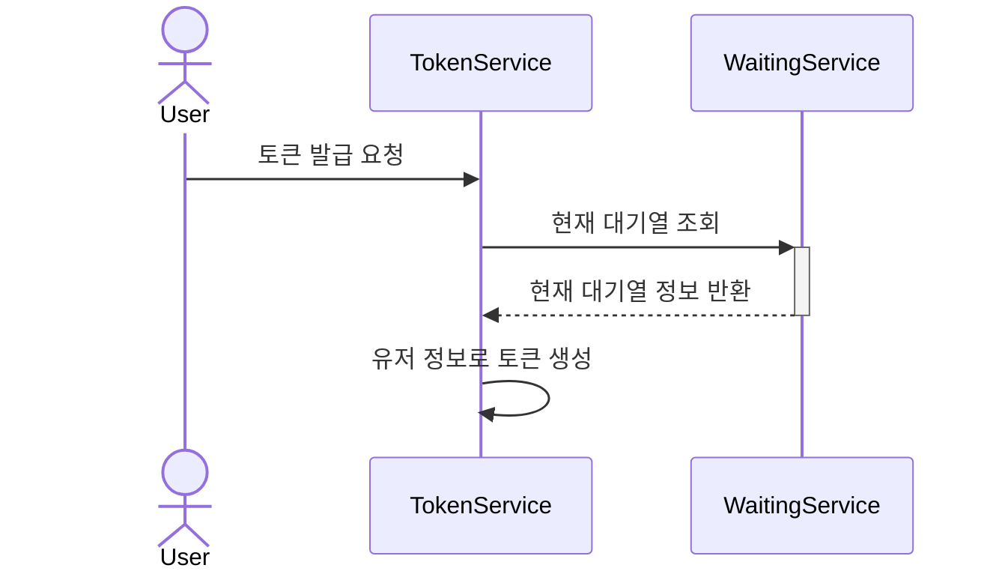
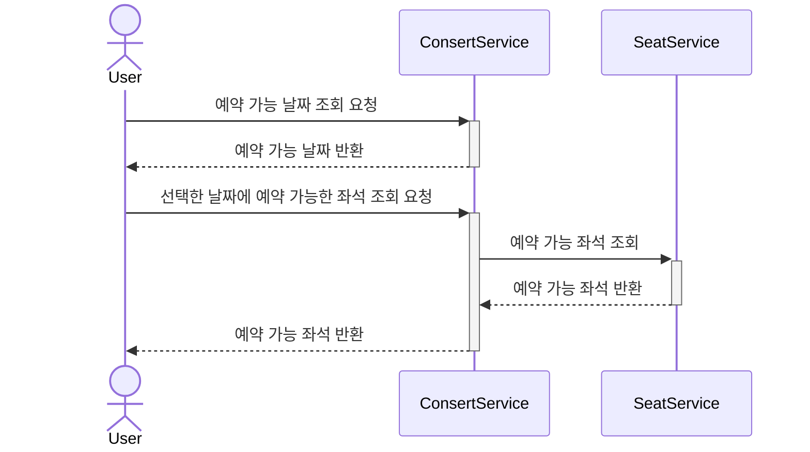
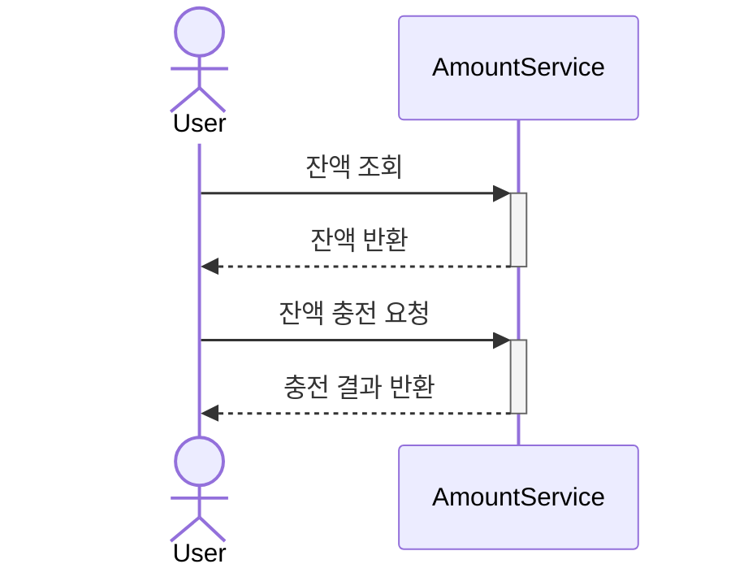
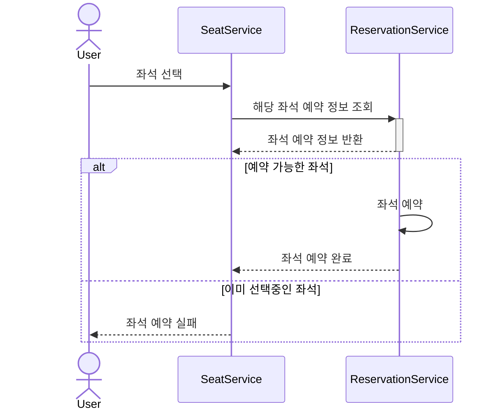
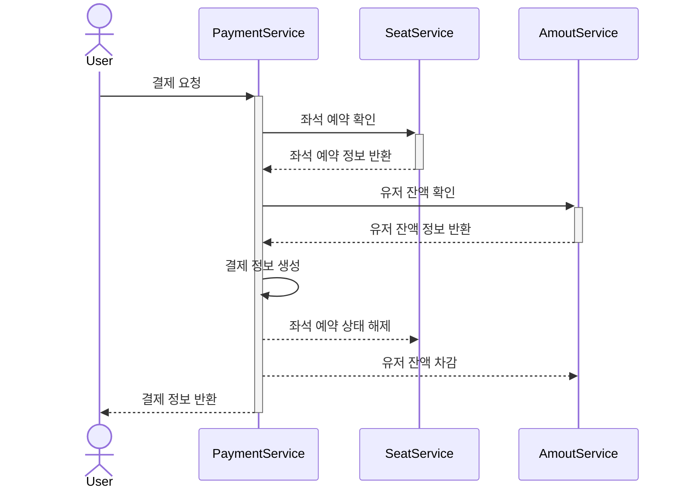
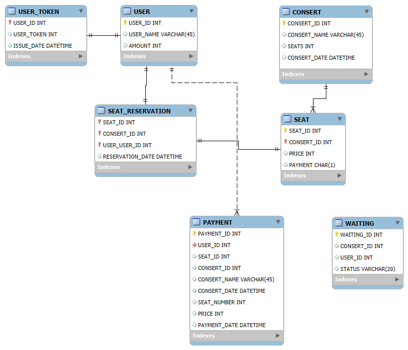

# Consert Reservation API

## 요구사항
- 아래 5가지 API 를 구현합니다.
    - 유저 토큰 발급 API
    - 예약 가능 날짜 / 좌석 API
    - 좌석 예약 요청 API
    - 잔액 충전 / 조회 API
    - 결제 API
- 각 기능 및 제약사항에 대해 단위 테스트를 반드시 하나 이상 작성하도록 합니다.
- 다수의 인스턴스로 어플리케이션이 동작하더라도 기능에 문제가 없도록 작성하도록 합니다.
- 동시성 이슈를 고려하여 구현합니다.
- 대기열 개념을 고려해 구현합니다.

## Sequence Diagram

### 유저 토큰 발급 API



### 예약 가능 날짜 / 좌석 API



### 잔액 충전 / 조회 API



### 좌석 예약 요청 API



### 결제 API



## ERD


## API DOCS

### 콘서트 목록 조회
`GET /consert`
- 콘서트 목록을 조회

**Example Request**
```
GET /consert HTTP/1.1
Host: {{url}}
```

**Example Response**
```
HTTP/1.1 200 OK
Content-Type: application/json

{
  "statusCode": 200,
  "message" : "success",
  "data": [
    {
        consertId: 1,
        consertName: "에스파 콘서트",
        seats: 50,
        consertDate: "2024-07-08 18:00:00"
    },
    {
        consertId: 2,
        consertName: "뉴진스 콘서트",
        seats: 50,
        consertDate: "2024-07-09 15:00:00"
    }
  ]
}
```
```
HTTP/1.1 404 Not Found
Content-Type: application/json

{
  "statusCode": 404,
  "message" : "Not Found"
}
```

### 입력한 날짜의 콘서트 목록 조회
`GET /consert/:date`
- 입력한 날짜에 진행하는 콘서트 목록을 조회

**Parameter**
| 키 | 타입 | 설명 |
| --- | --- | --- |
| date | string | 콘서트 날짜 |

**Example Request**
```
GET /consert/2024-07-08 18:00:00 HTTP/1.1
Host: {{url}}
```

**Example Response**
```
HTTP/1.1 200 OK
Content-Type: application/json

{
  "statusCode": 200,
  "message" : "success",
  "data": [
    {
        consertId: 1,
        consertName: "에스파 콘서트",
        seats: 50,
        consertDate: "2024-07-08 18:00:00"
    }
  ]
}
```
```
HTTP/1.1 404 Not Found
Content-Type: application/json

{
  "statusCode": 404,
  "message" : "Not Found"
  "error" : "해당 날짜에 예약 가능한 콘서트가 없습니다."
}
```

### 예약 가능 좌석 조회
`GET /consert/seat/:id`
- 입력한 날짜에 진행하는 콘서트 목록을 조회

**Parameter**
| 키 | 타입 | 설명 |
| --- | --- | --- |
| id | number | 콘서트ID |

**Example Request**
```
GET /consert/seat/:id HTTP/1.1
Host: {{url}}
```

**Example Response**
```
HTTP/1.1 200 OK
Content-Type: application/json

{
  "statusCode": 200,
  "message" : "success",
  "data": [
    {
        seatId: 1,
        consertId: 1,
        price: 50000,
        payment: "N"
    }
  ]
}
```
```
HTTP/1.1 404 Not Found
Content-Type: application/json

{
  "statusCode": 404,
  "message" : "Not Found"
  "error" : "예약 가능한 좌석이 없습니다."
}
```

### 사용자 잔액 조회
`GET /amount/:id`
- 사용자 잔액 조회

**Authorization**  
`Bearer {userToken}`

**Parameter**
| 키 | 타입 | 설명 |
| --- | --- | --- |
| id | number | 사용자ID |

**Example Request**
```
GET /amount/12 HTTP/1.1
Host: {{url}}
```

**Example Response**
```
HTTP/1.1 200 OK
Content-Type: application/json

{
  "statusCode": 200,
  "message" : "success",
  "data": {
    userId: 12,
    userName: "최승준",
    amount: 15000
   }
}
```
```
HTTP/1.1 404 Not Found
Content-Type: application/json

{
  "statusCode": 404,
  "message" : "Not Found"
  "error" : "해당 사용자 정보가 없습니다."
}
```

### 사용자 잔액 충전
`PATCH /amount/charge`
- 사용자 잔액 조회

**Authorization**  
`Bearer {userToken}`

**Request Body**
| 키 | 타입 | 설명 |
| --- | --- | --- |
| id | number | 사용자ID |
| amount | number | 충전할 금액 |

**Example Request**
```
PATCH /amount/charge HTTP/1.1
Host: {{url}}
Content-Type: application/json
Content-Length: 36

{
    id: 12,
    amount: 40000
}
```

**Example Response**
```
HTTP/1.1 200 OK
Content-Type: application/json

{
  "statusCode": 200,
  "message" : "success",
  "data": {
    userId: 12,
    userName: "최승준",
    amount: 15000
   }
}
```
```
HTTP/1.1 404 Not Found
Content-Type: application/json

{
  "statusCode": 404,
  "message" : "Not Found"
  "error" : "해당 사용자 정보가 없습니다."
}
```

### 사용자 토큰 발급
`POST /token/issu`
- 사용자 토큰 발급

**Request Body**
| 키 | 타입 | 설명 |
| --- | --- | --- |
| id | number | 사용자ID |

**Example Request**
```
POST /token/issu HTTP/1.1
Host: {{url}}
Content-Type: application/json
Content-Length: 39

{
    userId: 12
}
```

**Example Response**
```
HTTP/1.1 201 Created
Content-Type: application/json

{
  "statusCode": 201,
  "message" : "Created",
  "data": {
    userId: 12,
    userToken: "...",
    issueDate: 2024-07-04 21:00:23
   }
}
```
```
HTTP/1.1 403 Forbidden
Content-Type: application/json

{
  "statusCode": 402,
  "message" : "Forbidden"
  "error" : "해당 사용자 정보가 없습니다."
}
```

### 좌석예약
`POST /reservation/seat`
- 좌석 임시 예약

**Authorization**  
`Bearer {userToken}`

**Request Body**
| 키 | 타입 | 설명 |
| --- | --- | --- |
| userId | number | 사용자ID |
| consertId | number | 콘서트ID |
| seatId | number | 좌석ID |

**Example Request**
```
POST /reservation/seat HTTP/1.1
Host: {{url}}
Content-Type: application/json
Content-Length: 56

{
    userId: 12,
    consertId: 1,
    seatId: 11
}
```

**Example Response**
```
HTTP/1.1 200 OK
Content-Type: application/json

{
  "statusCode": 200,
  "message" : "success",
  "data": {
    userId: 12,
    consertId: 1,
    seatId: 11,
    reservationDate: "2024-07-03 11:46:23"
  }
}
```
```
HTTP/1.1 404 Not Found
Content-Type: application/json

{
  "statusCode": 404,
  "message" : "Not Found"
  "error" : "해당 좌석 정보가 없습니다."
}
```
```
HTTP/1.1 409 Conflict
Content-Type: application/json

{
  "statusCode": 409,
  "message" : "Conflict"
  "error" : "이미 선택중인 좌석입니다."
}
```

### 결제
`POST /consert/payment`
- 콘서트 좌석 결제

**Authorization**  
`Bearer {userToken}`

**Request Body**
| 키 | 타입 | 설명 |
| --- | --- | --- |
| userId | number | 사용자ID |
| consertId | number | 콘서트ID |
| seatId | number | 좌석ID |

**Example Request**
```
POST /reservation/seat HTTP/1.1
Host: {{url}}
Content-Type: application/json
Content-Length: 56

{
    userId: 12,
    consertId: 1,
    seatId: 11
}
```

**Example Response**
```
HTTP/1.1 201 Created
Content-Type: application/json

{
  "statusCode": 201,
  "message" : "Created",
  "data": {
    paymentId; 1,
    userId: 12,
    consertId: 1,
    seatId: 11,
    consertName: "에스파 콘서트",
    consertDate: "2024-07-08",
    price: 50000,
    paymentDate: "2024-07-03"
  }
}
```
```
HTTP/1.1 404 Not Found
Content-Type: application/json

{
  "statusCode": 404,
  "message" : "Not Found"
  "error" : "해당 콘서트 좌석 정보가 없습니다."
}
```